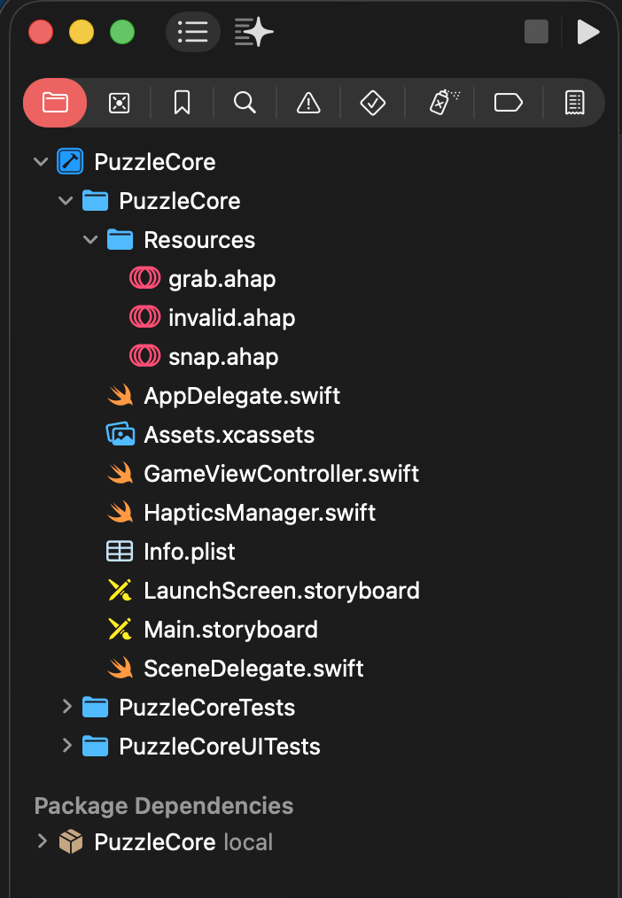

# PuzzleCore Phase-0 Demo

This repository contains the Phase-0 vertical slice for the PuzzleCore 3D puzzle game.

## Demo

[https://github.com/user-attachments/assets/demo.MP4](https://github.com/akhlaqahmad/PuzzleCore/blob/main/demo.MP4)

*(Note: The `demo.MP4` file is located in the root directory of this repository.)*

## Architecture

The project is divided into two parts:
1.  **PuzzleCore (App)**: The iOS Application using UIKit and SceneKit.
2.  **PuzzleCore (Package)**: A pure Swift local package containing the game logic, grid math, and validation rules.

## Setup Instructions

1.  Open `PuzzleCore.xcodeproj` in Xcode.
2.  Ensure the local package is correctly loaded. If missing, drag the `LocalPackages/PuzzleCore` folder into the Xcode Project Navigator.
3.  **Haptics Setup**:
    -   Ensure `grab.ahap`, `snap.ahap`, and `invalid.ahap` are in the **Copy Bundle Resources** build phase of the App Target.
    -   These files are located in `PuzzleCore/Resources/`.

    

## Running Tests

To run the unit tests for the logic core and the app:

1.  Select the `PuzzleCore` scheme or `PuzzleCoreTests` scheme in Xcode.
2.  Press `Cmd+U`.
3.  Alternatively, use the command line for the package logic:
    ```bash
    cd LocalPackages/PuzzleCore
    swift test
    ```

## Tuning

-   **Snap Thresholds & Drag Height**: Check `GameViewController.swift` constants:
    ```swift
    private let cellSize: Float = 1.0
    private let dragPlaneY: Float = 0.5
    private let snapThreshold: Float = 0.5
    ```
-   **Haptics**:
    -   Modify `.ahap` files in `PuzzleCore/Resources/`.
    -   Trigger logic is in `GameViewController.swift` (`handlePan`, `handleTap`).
    -   Haptic engine logic is in `HapticsManager.swift`.

## Key Files

-   **Logic**: `LocalPackages/PuzzleCore/Sources/PuzzleCoreKit/PuzzleCore.swift` (Grid, Piece, Validation).
-   **Game Loop**: `PuzzleCore/GameViewController.swift` (Gestures, SceneKit, State Management).
-   **Haptics**: `PuzzleCore/HapticsManager.swift`.

## Features Implemented

-   **Grid**: 4x4 mathematical grid.
-   **Piece**: L-shape and T-shape (rotateable).
-   **Interaction**: Drag to move, tap to rotate.
-   **Validation**: Bounds check, Overlap check (Logic-based).
-   **Feedback**: Visual snap/color change, Haptic feedback (Core Haptics).
-   **Camera**: Fixed perspective with LookAt constraint.
